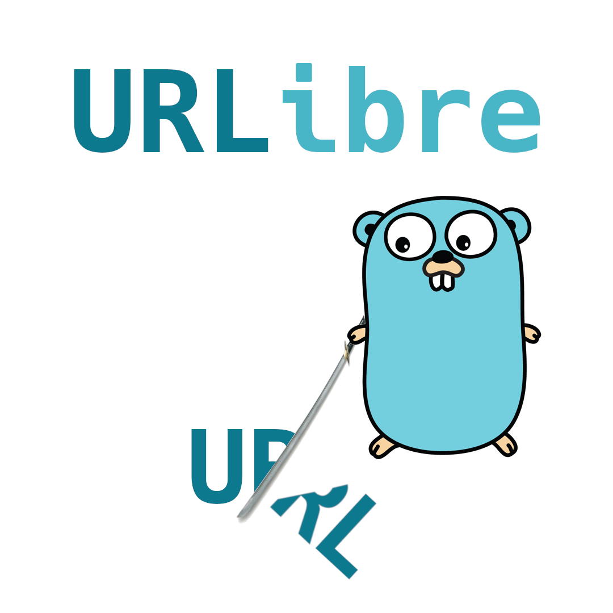

# Urlibre

An Open Source & minimal URL Shortener written in Go.

## Database
Urlibre uses mongoDB to store URL's!

## Features
 - Create URLS
 - Get redirected to said URLS
 - URL validation
 - Substring filtering based on a file
 - Delete expired urls(WIP)
 - Docker(WIP)

## Contributing
Feel free to send PR's i will do my best to review and merge them
just always keep in mind to keep things minimal!

# Hosting
This section is not done yet since i haven't written the configs for
nginx docker etc...
**If you have the skills and the time then please send a PR!**

## Docker + Nginx

***WIP***

## Docker

***WIP***

## Nginx

***WIP***
